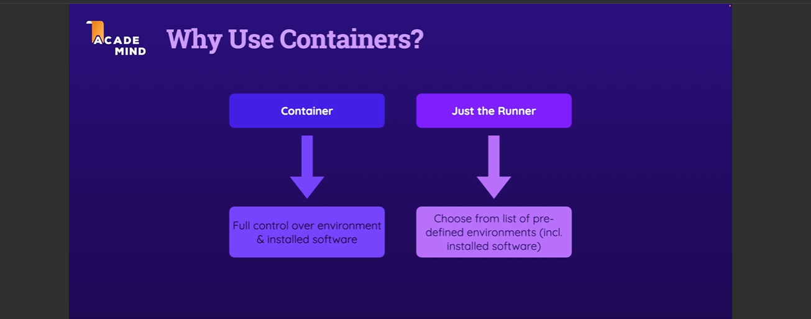
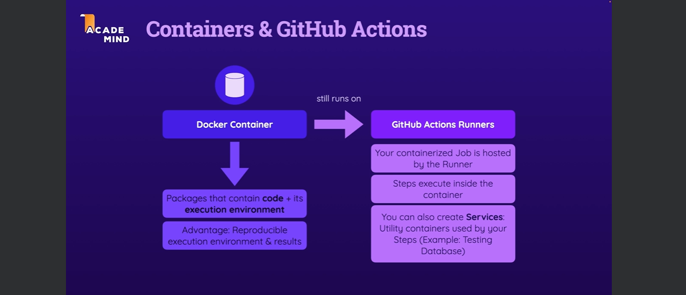
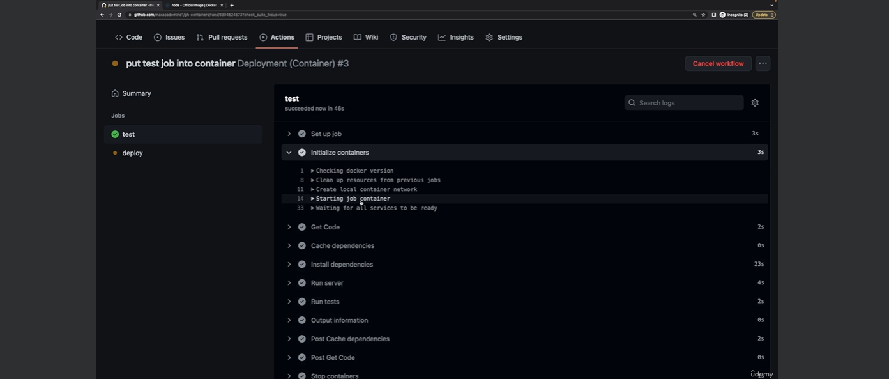
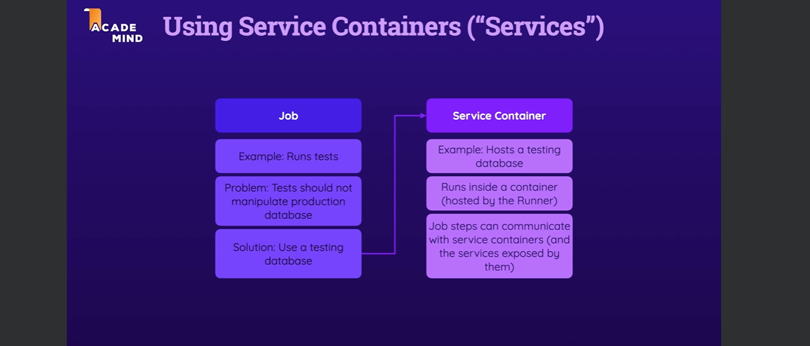

# jobs & docker containers

## module introduction

## what are containers?
the idea behind container is to run our code independent of the machine configuration and settings.
- packages that container code + its execution environment
- advantage: reproducible execution environment & results


## why might you want to use containers (with github actions)?
there are two possibilities either we run our github action on the the runner or inside container on the runner, if we run directly on the host machine we are limited to the host machine setup, and when run on the container we are free to setup our own environment and then implement this container on the runner but in this case all the steps we be ran inside the container.

- you can define container by set up docker file using `From` the base image you want to create you container
- define env vars you want to use in the container
- working directory
- package and dependencies need to install for the container using `RUN` and `COPY` 
  




- with container you have full control over environment & installed software
- just the runner: choose from list of predefined environment(include installed software)

## demo project setup & a dockerfile

## run jobs in container
as mentioned before for full control over environment here we run our jobs steps inside container image such as `node:16` which is prebuild container image and run all other steps inside this container `node:16` which hosted by a runner `ubuntu-latest`.

here is the code snips
```yml
name: Deployment (Container)
on:
  push:
    branches:
      - main
      - dev
env:
  CACHE_KEY: node-deps
  MONGODB_DB_NAME: gha-demo
jobs:
  test:
    environment: testing
    runs-on: ubuntu-latest
    container: 
      image: node:16
      # here we can define env vars if image needed
      # env:
    env:
      MONGODB_CONNECTION_PROTOCOL: mongodb+srv
      MONGODB_CLUSTER_ADDRESS: cluster0.ntrwp.mongodb.net
      MONGODB_USERNAME: ${{ secrets.MONGODB_USERNAME }}
      MONGODB_PASSWORD: ${{ secrets.MONGODB_PASSWORD }}
      PORT: 8080
    steps:
      - name: Get Code
        uses: actions/checkout@v3
      - name: Cache dependencies
        uses: actions/cache@v3
        with:
          path: ~/.npm
          key: ${{ env.CACHE_KEY }}-${{ hashFiles('**/package-lock.json') }}
      - name: Install dependencies
        run: npm ci
      - name: Run server
        run: npm start & npx wait-on http://127.0.0.1:$PORT # requires MongoDB Atlas to accept requests from anywhere!
      - name: Run tests
        run: npm test
      - name: Output information
        run: |
          echo "MONGODB_USERNAME: $MONGODB_USERNAME"
  deploy:
    needs: test
    runs-on: ubuntu-latest
    steps:
      - name: Output information
        env:
          PORT: 3000
        run: |        
          echo "MONGODB_DB_NAME: $MONGODB_DB_NAME"
          echo "MONGODB_USERNAME: $MONGODB_USERNAME"
          echo "${{ env.PORT }}"

```


## service containers - theory



if you want to run a testing container on the production environment dataset for manipulation there will be problem the solution is to use a testing database using the service container which allow as to run another service side by side the container hosted by runner
example:
hosts a testing database

job steps can communicate with service containers (and the service exposed by them)

## adding services (via service containers)

## communication between jobs & service containers

## module summary